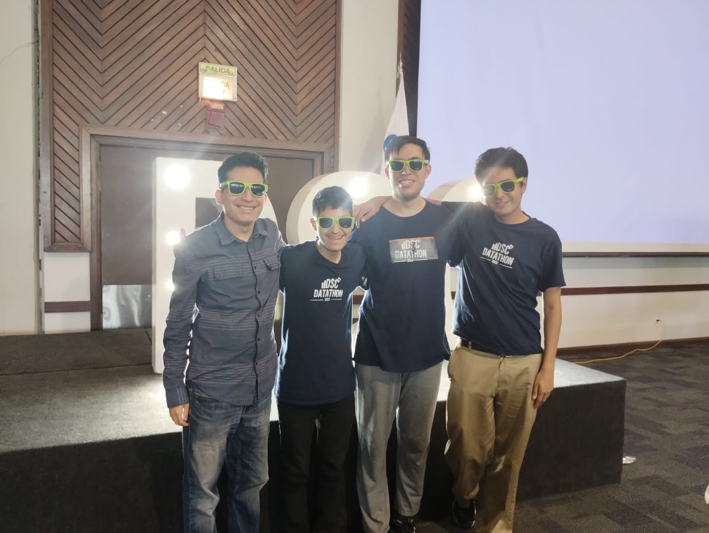

<h1 align="center">Hi 👋, I'm Juan Daniel</h1>
<h3 align="center">A passionate self-taught person. Upcoming software engineer.</h3>

- 🌱 I’m currently learning **PHP, React JS, Angular, Flask**

- 💬 Ask me about **CSS, Git, SCSS, OOP**

- 📫 How to reach me **j_danny07@hotmail.com**

<h3 align="left">Connect with me:</h3>

<h3 align="left">Languages and Tools:</h3>

                             

## Soft Skills
### 🚀 Self-taught
I thrive on self-directed learning and have a knack for exploring new technologies independently. I love diving into documentation, tutorials, and online resources to expand my knowledge beyond the classroom.

### 📢 Communication
Clear and effective communication is at the heart of successful collaboration. I possess excellent verbal and written communication skills, allowing me to convey complex ideas with ease. I enjoy engaging with team members, discussing project requirements, and providing progress updates.

### 🤝 Empathy
Understanding the needs and perspectives of users is crucial for creating impactful software solutions. I bring a strong sense of empathy to my work, enabling me to deeply understand user requirements and develop intuitive and user-friendly applications.

### 🤝 Teamwork
Collaboration fuels innovation, and I thrive in diverse team environments. I actively contribute ideas, listen attentively to others, and foster an inclusive and supportive atmosphere. Together, we can achieve remarkable results.

### 📚 Passion for Learning & Teaching
I have an insatiable thirst for knowledge and a genuine passion for learning. Keeping up with the latest industry trends and technologies is an exciting journey for me. I also find joy in sharing my knowledge and experiences, whether it's through mentoring others or teaching what I've learned.

## Biggest Projects
### Public
<table width="100%">
	<thead>
		<th span="col">Project ⚙️</th>
        <th span="col">Client</th>
		<th span="col">Description 📝</th>
		<th span="col">Role 🧑‍🏭</th>
		<th span="col">Images</th>
	</thead>
	<tbody>
        <tr>
            <th span="row"><a href="https://github.com/DannyJr08/Reto-Sistemas-Multiagentes_Movilidad-Urbana">Traffic Simulation</a></th>
            <td>IBM</td>
            <td>On a college project in association with IBM, I developed as part of a team a traffic simulation on <strong>Unity</strong>, where the cars' behaviour was in <strong>Python</strong> with <strong>Mesa</strong> framework, focused on multiagents. API was made with <strong>Flask</strong>.</td>
            <td>Software Engineer Intern</td>
            <td>
                
            </td>
        </tr>
		<tr>
			<th span="row">
                <a href="https://github.com/DannyJr08/los-trabajos-de-steve_ssa-web">Heart Care Web App</a>
                

                <a href="https://github.com/omarsinho/SaludOS-Movil">Heart Care Mobile App</a>
            </th>
			<td>Secretaría de Salud</td>
			<td>On a college project in association with Secretaría de Salud, I developed as part of a team an <strong>iOS</strong> app addressed to heart disease patients, so they can register their blood pressure and pulse, check their statistics, and link with their medics in order to view their prescriptions. It was also developed a <strong>React JS</strong> web app, so medics can manage their patient, view their statistics, and assign prescriptions. For backend we used <strong>Firebase</strong>.</td>
			<td>Software Engineer Intern</td>
            <td>
                
                

                
                

                
                

                
                

                
                

                
                

                

                
                

                
                

                
                

                
                

                
            </td>
		</tr>
		<tr>
			<th span="row">
                <a href="https://github.com/jaiovi/Denso-Git">Human Resources Web App - Frontend</a>
                

                <a href="https://github.com/jaiovi/Boilerplate-Denso-API">Human Resources Web App - Backend</a>
            </th>
            <td>Denso México SA de Cv</td>
			<td>On a college project in association with Denso, I developed as part of a team a web app <strong>(React JS)</strong> to filter applicants, with a database <strong>(MariaDB)</strong> that collects candidates' information from a psychometric test <strong>(Unity)</strong> they previously take. API was developed with <strong>Python (Flask)</strong>.</td>
			<td>Software Engineer Intern</td>
			<td>
                <picture>
                    <source loading="lazy" srcset="img/Denso/Web/Web-Inicio.webp" type="image/webp">
                    
                </picture>
                

                <picture>
                    <source loading="lazy" srcset="img/Denso/Web/Lista-Candidatos.webp" type="image/webp">
                    
                </picture>
                

                

                
                

                <picture>
                    <source loading="lazy" srcset="img/Denso/Juego/Memoria.webp" type="image/webp">
                    
                </picture>
                

                <picture>
                    <source loading="lazy" srcset="img/Denso/Juego/Psicometrico.webp" type="image/webp">
                    
                </picture>
                

                
            </td>
		</tr>
        <tr>
            <th span="row"><a href="https://github.com/DannyJr08/IMECO-SP1_DSL-Musica">Basic Implementation of a DSL to Play Music</a></th>
            <td>None</td>
            <td>I developed a DSL parser equivalent to the MUT language in <strong>Python</strong>. In addition to analyzing the correct use of the musical language lexicon, it executes the input code with the sounds corresponding to the identified musical notes. It also recognizes the basic syntax of musical note lines, implementing the parser with the recursive descent method.</td>
            <td>Student</td>
            <td>Not applicable</td>
        </tr>
        <tr>
            <th span="row"><a href="https://github.com/DannyJr08/Reto-IoT_Ventinteligente">Internet of Things - "Ventinteligente"</a></th>
            <td>None</td>
            <td>I developed as part of a team a system that simulated a speed fan. The system is made up of an <strong>Arduino</strong>, a temperature sensor connected to it, an <strong>SQL database (MariaDB)</strong>, and an API that we made in <strong>PHP</strong>. The temperatures were recorded in the database, and with the temperature that was detected along with date and time, it is as the fan speeds were activated (from off to speed 3). In turn, the database also lists the room in which the sensor is located, as well as the energy cost.</td>
            <td>Student</td>
            <td>
                <picture>
                    <source loading="lazy" srcset="img/Ventinteligente/Ventinteligente-1.webp" type="image/webp">
                    
                </picture>
                

                <picture>
                    <source loading="lazy" srcset="img/Ventinteligente/Ventinteligente-2.webp" type="image/webp">
                    
                </picture>
                

                <picture>
                    <source loading="lazy" srcset="img/Ventinteligente/Ventinteligente-3.webp" type="image/webp">
                    
                </picture>
            </td>
        </tr>
	</tbody>
</table>

### Private
<table width="100%">
	<thead>
		<th span="col">Project ⚙️</th>
        <th span="col">Client/Enterprise</th>
		<th span="col">Description 📝</th>
		<th span="col">Role 🧑‍🏭</th>
		<th span="col">Images (if applicable)</th>
	</thead>
	<tbody>
        <tr>
            <th span="row">Smile Analysis Web App</th>
            <td>Instituto Tecnológico y de Estudios Superiores de Monterrey</td>
            <td>Development of an <strong>Angular</strong> web app for the smile analysis of the people shot by a webcam from their computer. It was used <strong>Azure</strong> due to the services of <strong>Blob Storage</strong> and <strong>Face</strong>. Deployment is on <strong>Microsoft SharePoint</strong>.</td>
            <td>Software Engineer Intern</td>
            <td>Not applicable</td>
        </tr>
		<tr>
			<th span="row">GYM Web App</th>
			<td>Instituto Tecnológico y de Estudios Superiores de Monterrey</td>
			<td>On a scholarship service college project, I develop as part of a team a web app <strong>(PHP)</strong>, so coaches from Wellness Center Gym can manage their students and statistics, as well as workout routines that will be available for students. For database we used <strong>MySQL</strong>.</td>
			<td>Software Engineer Intern</td>
            <td>Not applicable</td>
		</tr>
	</tbody>
</table>

### Events
<table width="100%">
	<thead>
		<th span="col">Event</th>
        <th span="col">Project ⚙️</th>
        <th span="col">Organization</th>
		<th span="col">Description 📝</th>
		<th span="col">Images</th>
	</thead>
	<tbody>
        <tr>
            <th span="row">DSC Datathon 2023</th>
            <th><a href="https://github.com/DannyJr08/LosPullRequest_VivaAerobus">VivaAerobus Challenge</a></th>
            <td>Data Science Club - Instituto Tecnológico y de Estudios Superiores de Monterrey</td>
            <td>Based on multiple datasets of the VivaAerobus web application feedback, in <strong>Python</strong> data was cleaned by getting rid of random comments, identifying the language of the comment, correcting their spelling, translating every comment to English, and getting id of comments with curse words. Normalization and classification of the rating (numeric values) in order to represent users' emotions. Implementation of a neural network to categorize the feedback comments and to determine if they are positive or negative.</td>
            <td>
                <picture>
                    <source loading="lazy" srcset="img/DSC-Datathon-2023/Viva-Ini.webp" type="image/webp">
                    
                </picture>
                

                <picture>
                    <source loading="lazy" srcset="img/DSC-Datathon-2023/Viva-Vis-1.png" type="image/webp">
                    
                </picture>
                

                <picture>
                    <source loading="lazy" srcset="img/DSC-Datathon-2023/Viva-Vis-2.png" type="image/webp">
                    
                </picture>
                

                <picture>
                    <source loading="lazy" srcset="img/DSC-Datathon-2023/Convivencia-1.jpeg" type="image/webp">
                    
                </picture>
                

                <picture>
                    <source loading="lazy" srcset="img/DSC-Datathon-2023/Convivencia-2.jpeg" type="image/webp">
                    
                </picture>
                

                <picture>
                    <source loading="lazy" srcset="img/DSC-Datathon-2023/Convivencia-3.jpeg" type="image/webp">
                    
                </picture>
            </td>
        </tr>
        <tr>
            <th span="row">iOS TecMTY Hack 2023</th>
            <th>
                <a href="https://github.com/DannyJr08/ExplorAR">ExplorAR - Frontend</a>
                

                <a href="https://github.com/william-monroy/explorar">ExplorAR - Backend</a>
            </th>
            <td>Instituto Tecnológico y de Estudios Superiores de Monterrey</td>
            <td><strong>iOS</strong> mobile application that is about a world-wide dictionary where the user can scan an object using Augmented Reality technology, add it a title and a description (these are reviewed by the <strong>OpenAI API</strong> in order to determine if the information is coherent). The user can view the dictionary of each community. When a user wants to view other definitions, they can visualize in 3D in the object that was scanned via AR technology.</td>
            <td>
                <picture>
                    <source loading="lazy" srcset="img/iOS-TecMTY-Hack-2023/ExplorAR-1.webp" type="image/webp">
                    
                </picture>
                

                <picture>
                    <source loading="lazy" srcset="img/iOS-TecMTY-Hack-2023/ExplorAR-2.webp" type="image/webp">
                    
                </picture>
                

                <picture>
                    <source loading="lazy" srcset="img/iOS-TecMTY-Hack-2023/ExplorAR-3.webp" type="image/webp">
                    
                </picture>
                

                <picture>
                    <source loading="lazy" srcset="img/iOS-TecMTY-Hack-2023/ExplorAR-4.webp" type="image/webp">
                    
                </picture>
                

                <picture>
                    <source loading="lazy" srcset="img/iOS-TecMTY-Hack-2023/ExplorAR-5.webp" type="image/webp">
                    
                </picture>
                

                <picture>
                    <source loading="lazy" srcset="img/iOS-TecMTY-Hack-2023/ExplorAR-6.webp" type="image/webp">
                    
                </picture>
                

                
            </td>
        </tr>
	</tbody>
</table>